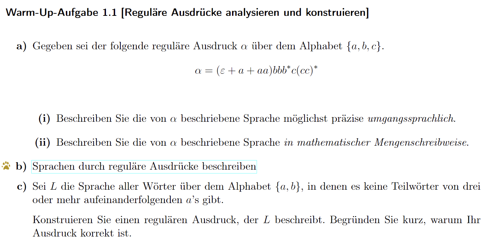
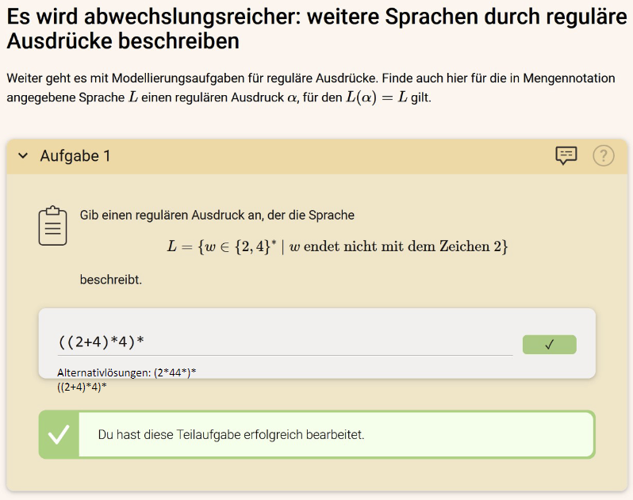
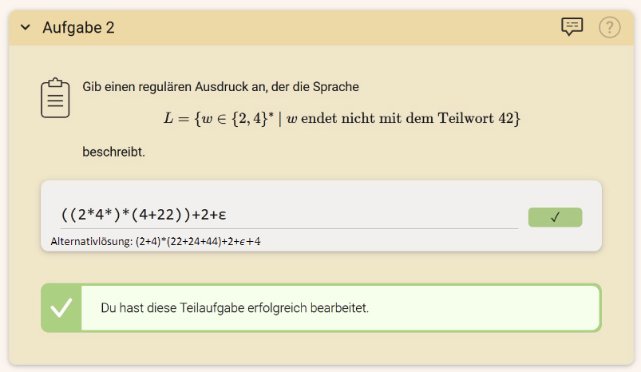
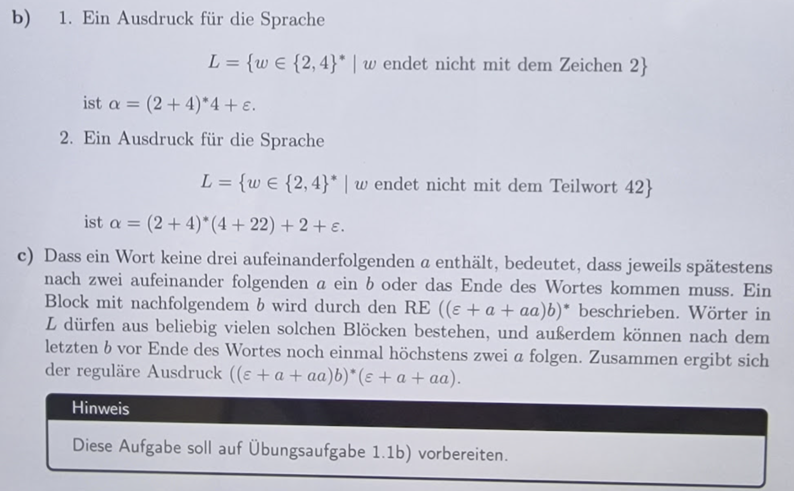

#### (i) 
Der reguläre Ausdruck α beschreibt eine Sprache, die folgende Form hat:
- Es beginnt entweder mit nichts (leeres Wort $\varepsilon$), einem 'a' oder zwei 'a's.
- Darauf folgt mindestens ein 'b', wobei beliebig viele weitere 'b's folgen können.
- Danach kommt genau ungerade Zahl von 'c's.

#### (ii)
In mathematischer Notation kann die Sprache L, die von α beschrieben wird, wie folgt definiert werden:
$L = \{w \mid w = (a + aa + \varepsilon)b^{3+n}c(cc)^m, n \geq 0, m \geq 0\}$

### b) iltis: Sprachen durch reguläre Ausdrücke beschreiben

