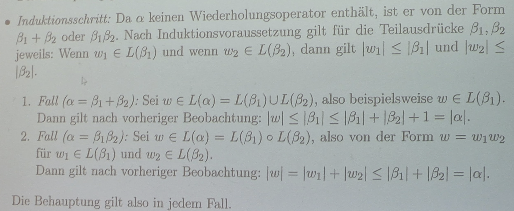

---

### Lösungsvorschlag:

#### a)
Für jeden regulären Ausdruck $\alpha$ ohne Wiederholungsoperator und jedes Wort $w \in L(\alpha)$ gilt $|w| \leq |\alpha|$.

Beweis durch strukturelle Induktion.

#### b)

