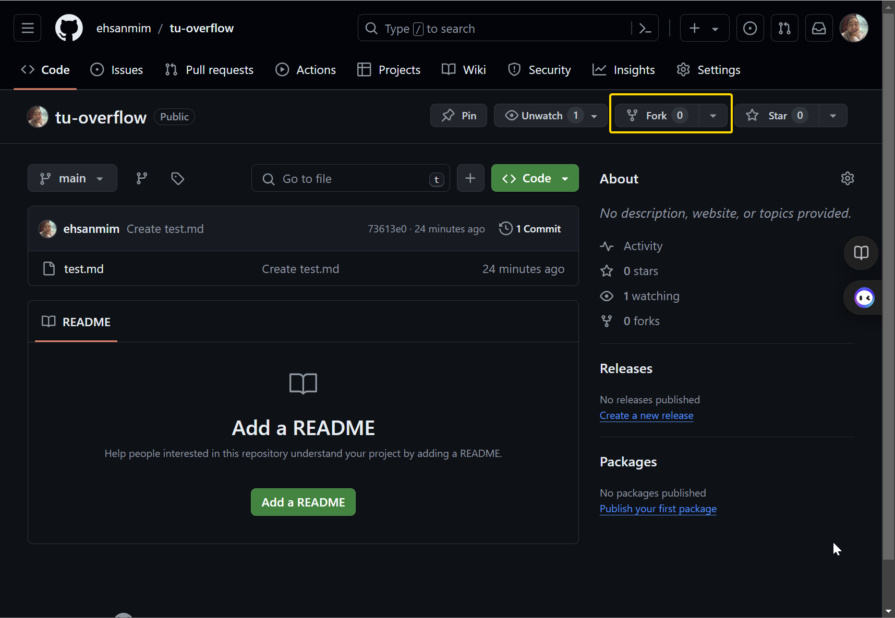
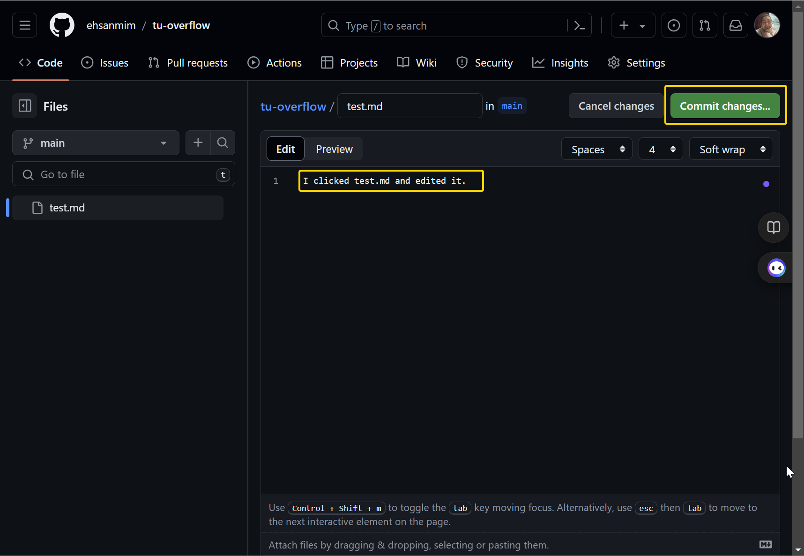
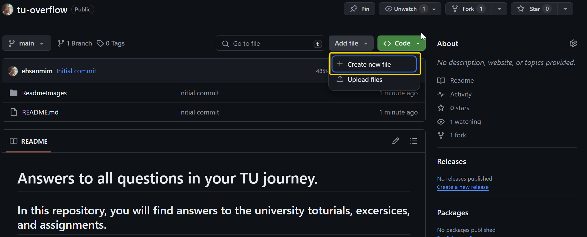
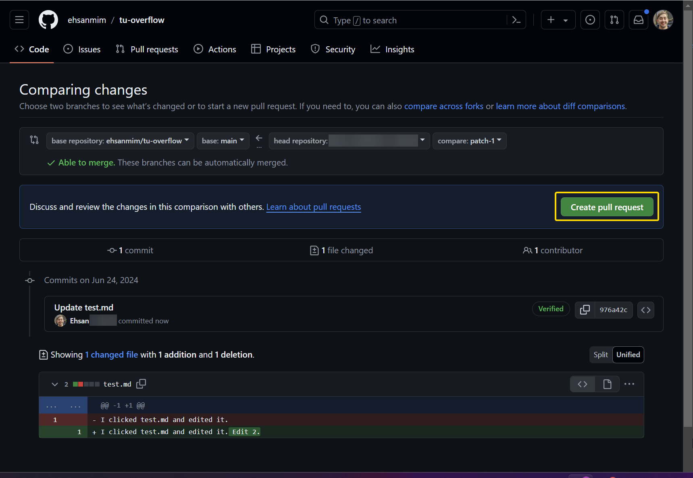
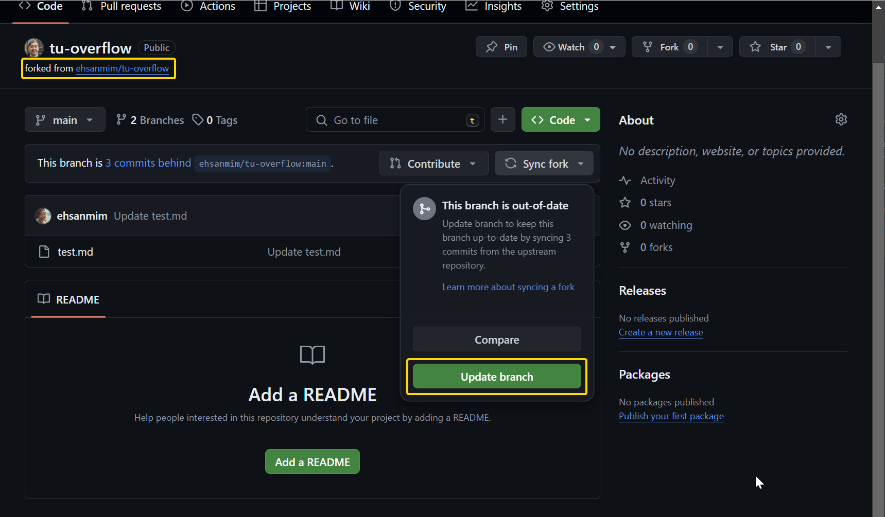

# Answers to all questions in your TU journey.

## In this repository, you will find answers to the university toturials, excersices, and assignments.

The structure of this repository is as follows:

```
  - Course
    - U as in Übung or T as in Tutorial or W as in Warmup
        - Number
            U or T or W pdf file
            - Answer#1 (as it seems to be the most accuarate).jpg or .md
            - Answer-alternative
            - image-1.jpg
            - image-2.jpg
            ...

```

## To help me keep this up to date you can contribute by adding your own answers as well.
- Click fork on the top right corner of this repository in GitHub.

- Edit the file you want to add your answer to. You can paste ./ReadmeImages/images here as well.

- Or add a new file with the plus sign.

- Click pull request so that I get notified and can merge your changes.

- If you wanted to continue working on this repository, you can keep your fork and add new answers to it. Do not forget that your fork will not be updated automatically as I update this repository. So click sync to keep your fork up to date.
